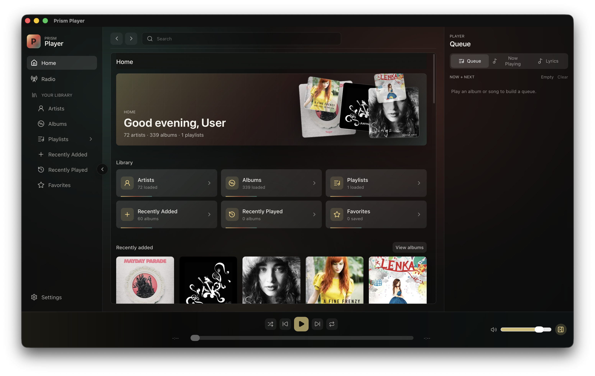
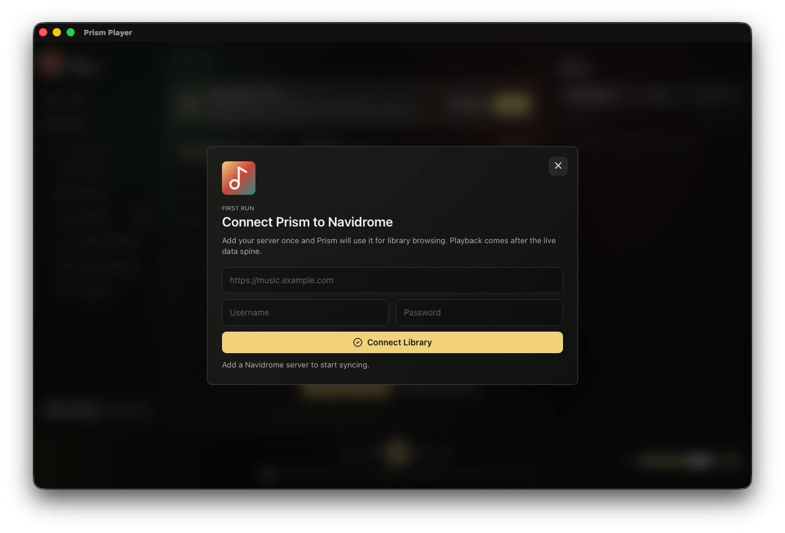
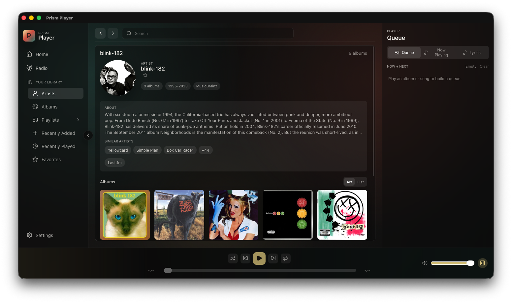
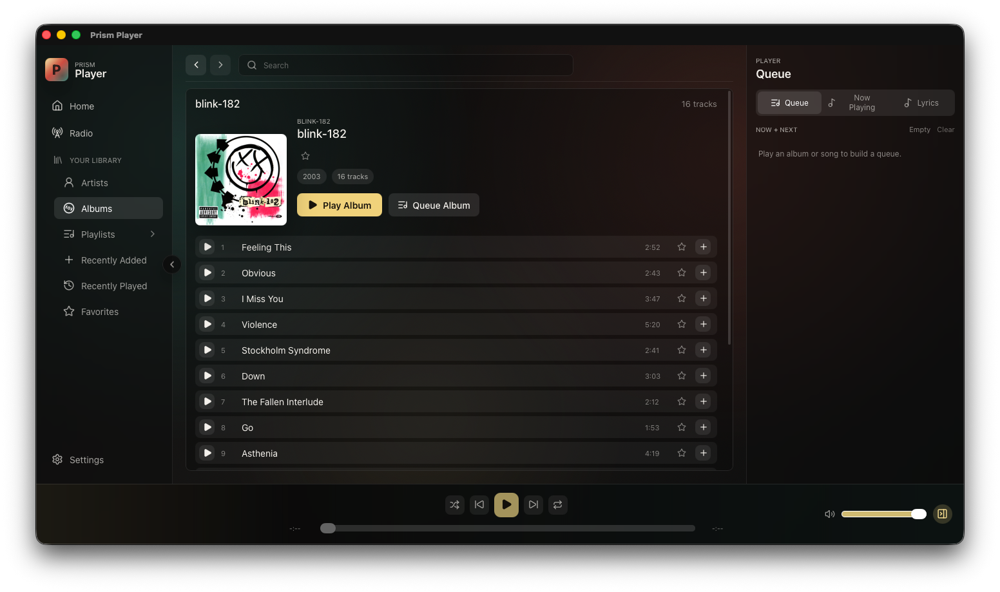
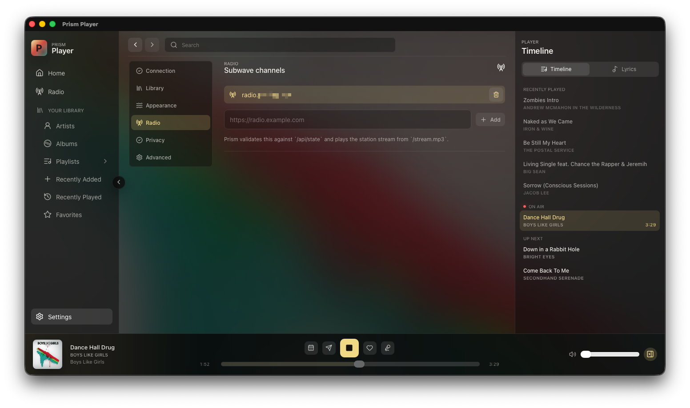
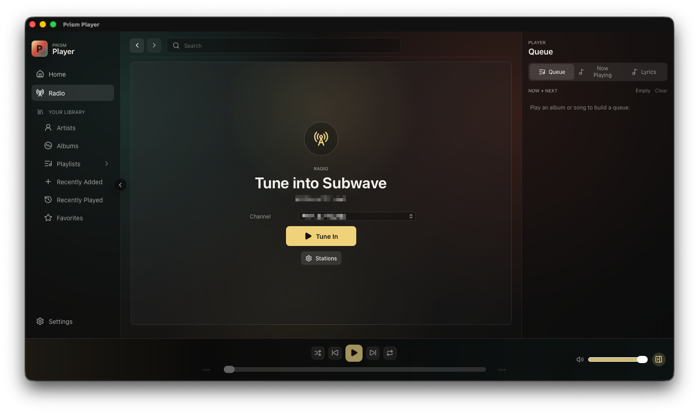
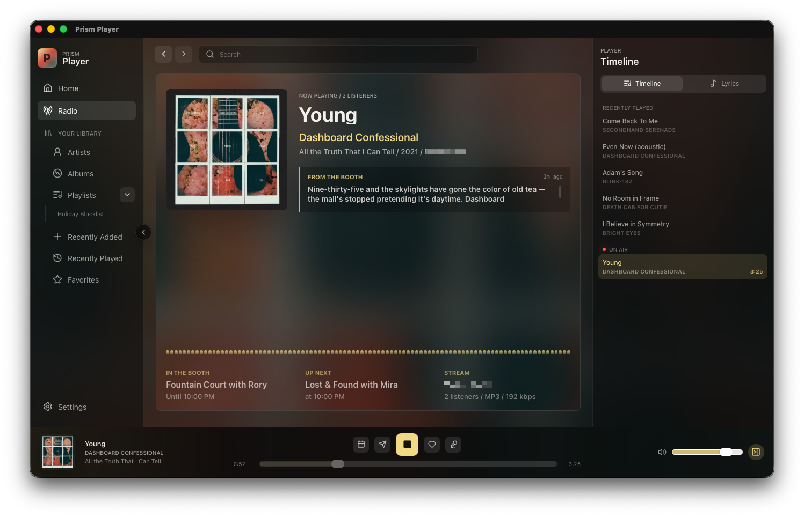
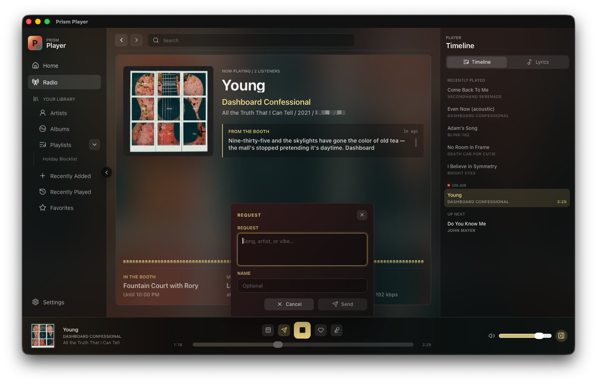

# Prism Player

**A desktop player for the music server you already use.**

Prism connects to Navidrome and other Subsonic-compatible servers, so you can play your library, manage the queue, and keep your playlists in one proper desktop app. If you use Subwave too, radio lives right there with the rest of your music.

It is still early, but there are builds for macOS and Windows.

> **Need help or want to talk about Prism?** [Join the Discord](https://discord.gg/aDEBQq3XtN). It is the quickest place for questions, ideas, and bug reports.

## Get Prism

Grab the installer for your platform from the [latest GitHub release](https://github.com/kylejschultz/prism-player/releases/latest).

Prism is pre-1.0 software. The main library and playback experience are in place, but app signing and auto-updates are not yet.

### Important: unsigned builds

The current macOS and Windows builds are *not yet code-signed*, so your operating system may warn you before opening them. That is expected for now.

- On macOS, if Prism is blocked, open it once, then go to *System Settings → Privacy & Security* and choose *Open Anyway* for Prism.
- On Windows, if Microsoft Defender SmartScreen shows “Windows protected your PC,” select *More info*, then *Run anyway*.

Only bypass these warnings if you downloaded Prism from the releases page above.

## First connection

1. Open Prism.
2. Enter the address of your Navidrome or other Subsonic-compatible server.
3. Sign in, then listen to your library.

Once you're connected, Prism gives you a simple place to browse the artists, albums, and music already on your server.

## Subwave Radio

Prism can tune into a Subwave station right alongside your library.

1. Open *Settings* and select *Radio*.
2. Under *Subwave channels*, add your station address, such as `https://subwave.example.com`.
3. Return to the *Radio* item in the sidebar, select the station, and choose *Tune In*.
4. While listening, you can check the schedule and booth feed, request a song, like the current track, or stop the stream.

Prism checks that the address is a Subwave station before connecting. You can save more than one station and switch between them later.

Once you're tuned in, Prism shows what is playing and keeps the station controls close by. Use the request button when you want to send something to the station.

## Status

Prism is pre-1.0 software. If something is broken or you have an idea, open a [GitHub issue](https://github.com/kylejschultz/prism-player/issues).

## Contributing

Want to work on Prism? Development setup, branches, tests, and release notes are in [CONTRIBUTING.md](CONTRIBUTING.md).

## More screenshots

Open the screenshot gallery

Click any screenshot to open it full size.

## Features at a glance

- Navidrome and Subsonic server support.
- Artists, albums, playlists, favorites, recently added, and recently played views.
- A proper queue, plus shuffle, repeat, seeking, and volume controls.
- Search for artists, albums, songs, and playlists.
- Playlist editing and favorites.
- Subwave radio with now-playing, schedules, requests, likes, and booth updates.
- Queue, now-playing details, and lyrics in the sidebar.

## Privacy

Prism stores your server connection and playback preferences locally. Optional anonymous analytics are opt-in. They only include app and install details, plus aggregate library counts; they do not include your account or playback data.

## License

[GNU General Public License v3.0](./LICENSE) — free to use, modify, and share. If you distribute a modified version, it needs to stay under the same license.
